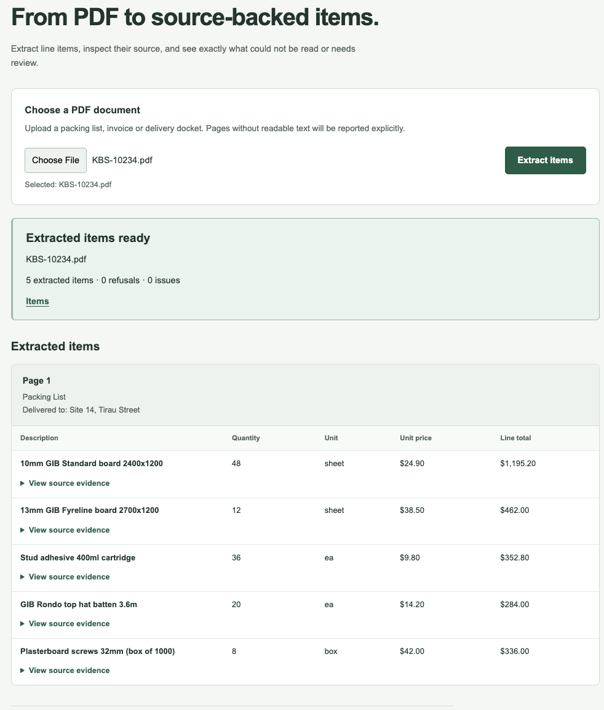

# Insta Quote AI — Full Stack Engineer Take-Home

**Tech stack:** Next.js · React · TypeScript · Node.js · PDF.js

## Overview

A small PDF extraction workflow built with Next.js and TypeScript. Upload a PDF to extract supported line items, review their page/source evidence, and see explicit refusals or issues when the document cannot be safely interpreted.

The goal is trustworthy output: unsupported or ambiguous data is surfaced rather than guessed. The original assessment brief is included in [test.md](test.md).

## Approach

Version 1 uses PDF.js for page-level text extraction, a deterministic candidate parser, and independent evidence and business validation. One application contains the upload UI and Node API route; no external services or API keys are needed.

- Every extracted number must be supported by its original page and source text.
- Missing values are not calculated and presented as extracted facts.
- Conflicting claims and arithmetic mismatches are surfaced without replacing printed values.
- A failure on one page preserves valid results from other pages.

AI coding assistance was used during development. Extraction has no runtime LLM, OCR or VLM.

## Architecture

```text
Browser upload → POST /api/extract → PDF reader → Candidate parser
              → Evidence + business validation → ExtractionResult → Results UI
```

The parser produces candidates, not trusted output. Candidates reach the user only after validation. The UI preserves page/context, expandable evidence, plain-language refusal reasons, and separate loading and fatal-error states.

## Result Model

The public contract is defined in [lib/contracts.ts](lib/contracts.ts):

- `items`: validated line items with page/source evidence. Numeric fields retain normalized and original values; `lineTotal` is optional.
- `refusals`: data that could not be safely extracted, with a scope and reason, such as a page with no usable text.
- `issues`: warnings or recoverable processing problems that need attention, such as discrepant pallet counts, total mismatches, or page-local processing failures.

```json
{
  "items": [],
  "refusals": [],
  "issues": []
}
```

The API accepts one PDF in the multipart field `file`. Successful requests return this result directly, including partial results and refusals. Fatal request failures use a separate `{ error: { code, message } }` response: 400 for invalid uploads, 422 for unreadable or unsupported encrypted documents, and 500 for processing failures.

## Sample Behaviour

All six PDFs are included in [data/](data/).

| Sample | Behaviour |
|---|---|
| [KBS-10234](data/KBS-10234.pdf) | 5 validated items; no refusals or issues |
| [KBS-10241](data/KBS-10241.pdf) | No usable text extracted by the V1 text reader on page 1; explicit refusal instead of empty success |
| [KBS-10255](data/KBS-10255.pdf) | 4 items; missing line totals remain absent; ambiguous weights flagged |
| [KBS-10262](data/KBS-10262.pdf) | 3 items; preserves the 14-loaded / 16-unloaded claims in discrepancy evidence |
| [KBS-10270](data/KBS-10270.pdf) | 4 items; flags the total mismatch and preserves the printed total |
| [KBS-DR118](data/KBS-DR118.pdf) | 21 items from readable pages; page 4 explicitly refused; page/context retained |

### UI Preview

Successful extraction of KBS-10234: five validated items, no refusals or issues, and expandable source evidence for each row.



## Run Locally

Requires **Node.js >= 22.13.0** and npm. Verified with Node 22.14.0 and npm 11.2.0.

```sh
npm ci
npm run dev
```

Open **http://localhost:3000**, choose a PDF and click **Extract items**. Expand **View source evidence** to review a value's origin.

For production mode, stop the dev server and run:

```sh
npm run build
npm start
```

No environment file or database is required.

## Tests

```sh
npm run test:reader
npm run test:parser
npm run test:validation
npm run test:api
npm run test:ui
npm run typecheck
npm run build
```

Tests focus on evidence validation, refusal reasons, partial failures, and preventing unsupported numeric inference. All five suites, typecheck and build passed in a clean dependency installation.

With a local server running, run the HTTP tests, including uploads of all six samples:

```sh
API_BASE_URL=http://localhost:3000 npm run test:api:http
```

To inspect the final extraction results for all samples:

```sh
npm run verify:extraction
```

The six samples were also checked through the production upload UI in Chrome, including evidence expansion, error states and a narrow viewport.

## Trade-offs and Limitations

- V1 reads PDF text layers only. Pages without usable text are refused; empty text alone does not establish whether a page is blank or scanned.
- The parser supports the supplied table families. Unusual fragment ordering, wrapped rows and hybrid image/text pages may be unsupported or incompletely detected. Evidence checks depend on text-layer and geometry fidelity.
- Total consistency checks are intentionally conservative and run only when the relevant rows and printed total can be validated within the same supported scope. Unsupported reconciliation scopes are explicitly reported as not checked.
- Runtime behaviour was verified locally. Uploads are held in memory without application size/page/concurrency limits; hosted/serverless behaviour for larger workloads remains unverified.

## Required Questions

### 1. What was the hardest decision and why did you choose that approach?

The hardest decision was whether to add OCR or a vision model for image-only pages. The samples made the limitation of a text-only approach clear: one entire sample and page 4 of the mixed document cannot be extracted by the V1 text-layer reader.

I chose explicit refusals because the assessment prioritises trustworthy numbers over maximum coverage. Given the five-hour scope, I prioritised completing and validating the full upload-to-evidence flow. Adding OCR/VLM would introduce another source of numeric transcription errors that would also need reliable verification. Separating reading from validation leaves room for an image reader while retaining the evidence and refusal rules.

### 2. Where are you not confident?

My main uncertainty is layout coverage beyond the supplied samples. Unusual fragment ordering, wrapped rows and hybrid pages may require additional parsing rules or an image-based fallback. In particular, readable text does not guarantee every region of a page was captured. I also have not verified hosted/serverless memory and concurrency behaviour for larger uploads.

### 3. What would you do with three more days?

First, trial an OCR/VLM fallback on image-only pages, with numeric transcription tests and the same evidence/business validation pipeline. Uncertain results would remain refusals.

Next, add page-region evidence for visual review and expand adversarial tests for damaged, hybrid and less structured documents. Finally, test deployment limits, introduce upload/concurrency bounds, and add focused diagnostics for processing time and extraction failures.
